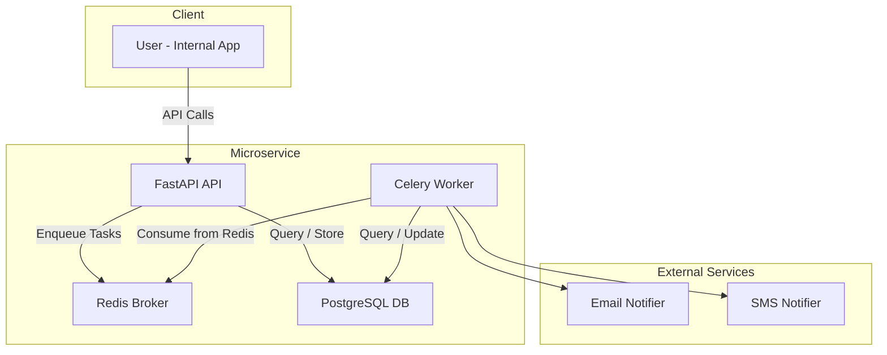

[](https://github.com/FrenyCS/wd-challenge/actions/workflows/devops.yml)

## Microservice for Property Alert Notifications

A Python microservice for sending property alert notifications via **email** and **SMS**, based on user preferences. Supports immediate and scheduled delivery, user preference management, and basic API key authentication.


### Architectural Approach

The service follows a layered architecture with some ideas from hexagonal architecture. The goal is to keep things simple but still clean and testable.



### Design Decisions
- Sending logic is decoupled via Notifier interfaces for email/SMS (easily extensible).
- PostgreSQL stores user preferences and notifications.
- Celery workers fetch due notifications and dispatch them via the appropriate channel.
- The `/notifications` endpoint receives the message content and scheduling time directly in the request.
- The service does not fetch property data — this must be provided in the request.
- If no `send_time` is included, the notification is sent immediately.
- User Preferences are stored via `/preferences/{user_id}` and include channel opt-ins (email, SMS).


### Authentication

The service uses API key authentication for internal use. Clients must include a header like: `x-api-key: your-api-key`


### Notifications API

Handles sending notifications to users.

	POST /notifications
	x-api-key: your-api-key
	Content-Type: application/json

```json
{
  "user_id": "12345",
  "send_time": "2025-03-28T14:30:00Z",
  "subject": "Check out new properties you might like!",
  "body": "Here are some new listings that match your preferences..."
}
```

- *send_at*: optional. If omitted, sends immediately.
-	*subject*: required for email; ignored for SMS.
-	*message*: required content.

### User Preferences API

Manage delivery preferences per user (email and/or SMS).

	GET /preferences/{user_id}
	Returns current delivery preferences.
	
	POST /preferences/{user_id}

```json
{
  "email_enabled": true,
  "sms_enabled": false,
  "email": "user@example.com",
  "phone_number": "+1234567890"
}
``` 

### Runnin in Codespaces

**1. Start services**

```bash
docker-compose up --build
``` 

- FastAPI will run on `http://localhost:8000`
- Redis, Postgres, and Celery workers will also start.
**Note:** If you encounter any errors, try running the `docker-compose up --build` command again. Occasionally, a race-condition error may occur on the first attempt. This is a known issue that could be addressed in future improvements.


**2. Accesing the app**  

If redirected to a Redis port (6379), just edit the browser URL to use the 8000 port:
`https://<your-codespace>-8000.app.github.dev/`

### Interactive API Docs

FastAPI automatically generates interactive API docs, in Codespaces, access it via:
`https://<your-codespace>-8000.app.github.dev/docs`. This provides a live interface to test and explore all endpoints, including `/notifications` and `/preferences/{user_id}`.

**Note:** Remember to click on the "Authorize" button at the top-right corner of the interactive API docs page to add the `x-api-key` value from the `.env.example` file before trying out any endpoint.


### Testing
Tests are grouped into two main categories:
- `tests/unit/`: fast unit tests for pure business logic, using mocked dependencies.
- `tests/integration/`: full-stack tests using the real PostgreSQL, Redis, and Celery services.

**Unit Tests**

Unit tests run automatically on every push via [GitHub Actions](https://github.com/FrenyCS/wd-challenge/actions/workflows/devops.yml), ensuring core logic remains reliable.

**Integration Tests**

Integration (regression) tests are executed automatically when running the system with Docker Compose.
After running: `docker-compose up --build` you'll see test results from the test-runner service in the logs, for example:
```bash
test_runner              | ========================= 4 passed, 1 warning in 1.55s =========================
```
This ensures that the entire microservice stack (FastAPI + PostgreSQL + Redis + Celery) is functioning end-to-end.


### Environment Variables

- `.env.example` provides safe default values.
- Create your own `.env` for local SMTP, Twilio, or other real credentials.
- `.env` is gitignored for safety.
