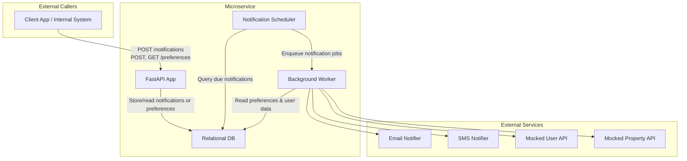

[](https://github.com/FrenyCS/wd-challenge/actions/workflows/devops.yml)

## Microservice for Property Alert Notifications

This is a small Python-based microservice that sends property alert notifications by email and SMS, based on user preferences. It supports scheduling, user preference management, and basic API key authentication.

### Architectural Approach

The service follows a layered architecture with some ideas from hexagonal architecture. The goal is to keep things simple but still clean and testable.



- Core logic is separated from frameworks like FastAPI or Celery.
- Notification sending is handled through a Notifier interface (email and SMS as adapters).
- External systems like the user database and property listings are mocked.

### Design Decisions
- The `/notifications` endpoint receives the message content and scheduling time directly in the request.
- If no `send_time` is included, the notification is sent immediately.
- User preferences (like preferred channels) are stored and managed via `/preferences/{user_id}`.
- The service does not fetch property data — this must be provided in the request.

### Authentication

The service uses API key authentication for internal use. Clients must include a header like: `x-api-key: your-api-key`


### Notifications API

Handles sending notifications to users.

	POST /notifications
	x-api-key: your-api-key
	Content-Type: application/json
	
	{
	  "user_id": "12345",
	  "send_time": "2025-03-28T14:30:00Z",
	  "subject": "Check out new properties you might like!",
	  "body": "Here are some new listings that match your preferences..."
	}

	- user_id: required
	- send_time: optional (if missing, send immediately)
	- subject: optional (not required in SMS, default value for email)
	- body: required for message content

### User Preferences API

Manage delivery preferences per user (email and/or SMS).

	GET /preferences/{user_id}
	Returns user’s current notification settings.
	
	POST /preferences/{user_id}
	
	{
	  "email_enabled": true,
	  "sms_enabled": false
	}

### How to Run in Codespaces

**Step 1. Build and run the app**  

Run ```docker-compose up --build``` in the terminal, this will:
- Start the FastAPI service at http://localhost:8000
- Start Redis (used as a message broker for background tasks)

**Step 2. Port forwarding in Codespaces**  

Port 8000 is already auto-forwarded via `.devcontainer/devcontainer.json`, just wait a few seconds (while the application startup is completed) and click “Open in Browser” when prompted.

**Step 3. Change the application port**
Codespaces is trying to use the redis port (something we can improve later) so you'll see an error, just *change the port value from 6379 to **8000*** in the openend url which has the pattern 
`https://<codespace-nickname>-<unique-hash-id>-<port>.app.github.dev/`

### Testing
- Unit tests cover key logic.
- Mock integration tests simulate sending notifications.

Instructions for running tests and setup are in the /tests folder.


### Environment Variables

A `.env.example` file is included with mock/stub values that are safe to version and use for testing or evaluation purposes.

If you need to use real credentials (e.g. for local SMTP or Twilio), you can create your own `.env` file in the root of the project. It will automatically be loaded and will override the default values in `.env.example`.

**Note:** The `.env` file is ignored by Git and should not be committed to version control.