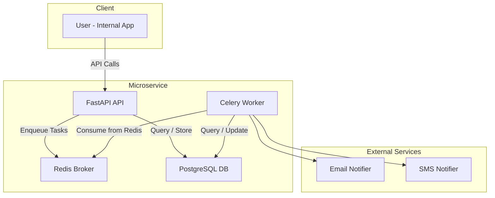

[](https://github.com/FrenyCS/wd-challenge/actions/workflows/devops.yml)

## Introduction

This project is a Python-based microservice for sending property alert notifications via email and SMS, based on user preferences. It was developed as part of a technical challenge for a company in the real estate sector.

Key features include:
- **Notification System**: Support for email and SMS notifications.
- **API Development**: Endpoints for scheduling notifications and managing user preferences.
- **Task Queue**: A queuing mechanism for handling scheduled tasks.
- **Testing**: Unit tests for core logic and mock integration tests for the system.

The full challenge description can be found in the [challenge.md](./challenge.md) file.

---

## Challenge Context

The goal of this challenge was to design and implement a simple yet functional prototype with the following requirements:
- Build a notification system for email and SMS.
- Develop APIs for scheduling notifications and managing user preferences.
- Use a task queue for handling scheduled tasks.
- Provide unit and integration tests.

---

## Architecture

The service follows a layered architecture with some ideas from hexagonal architecture. The goal is to keep things simple but still clean and testable.



### Design Decisions
- Sending logic is decoupled via Notifier interfaces for email/SMS (easily extensible).
- PostgreSQL stores user preferences and notifications.
- Celery workers fetch due notifications and dispatch them via the appropriate channel.
- The `/notifications` endpoint receives the message content and scheduling time directly in the request. Notifications can be sent immediately or scheduled for a specific time in the future.
- **Content Handling**: The `/notifications` endpoint accepts raw data for the notification content. This approach simplifies the architecture and avoids querying external systems for content generation.
- **Integration with External Systems**: This microservice does not pull data from external property management systems or user databases. Instead, it relies on clients (internal systems) to provide all necessary data via API calls. This approach ensures the microservice remains highly decoupled and self-contained.
- **Authentication**: The service uses API key authentication for simplicity. This ensures that only authorized clients can access the endpoints.
- **Architectural Quantum**: The microservice has all the resources it needs, including its own database, task queue, and notification logic. This independence aligns with microservice principles, making it easier to scale, maintain, and deploy without dependencies on other systems.

---

## Technology Choices and Justification

The following technologies were chosen for their suitability to the project's requirements:

- **FastAPI**: Chosen for its high performance and ease of use. Its built-in support for asynchronous programming and automatic API documentation made it ideal for quickly building a robust and testable API for this microservice.
- **PostgreSQL**: Selected for its reliability and ACID compliance, ensuring consistent storage of user preferences and notification schedules. Its scalability and support for relational data make it a perfect fit for structured data needs.
- **Redis**: Used as a message broker for its low-latency operations and seamless integration with Celery. Redis ensures efficient task queuing, which is critical for handling scheduled notifications in real-time.
- **Celery**: Chosen for its ability to handle asynchronous task execution. It enables the microservice to process notifications independently of API requests, ensuring scalability and responsiveness.

This stack was selected to ensure the microservice is performant, scalable, and aligned with the challenge's requirements.

---

## API Documentation

### Authentication

The service uses API key authentication for internal use. Clients must include a header like: `x-api-key: your-api-key`.

### Notifications API

Handles sending notifications to users.

#### POST /notifications
```json
{
  "user_id": "12345",
  "send_at": "2025-03-28T14:30:00Z",
  "subject": "Check out new properties you might like!",
  "message": "Here are some new listings that match your preferences..."
}
```
- *send_at*: optional. If omitted, sends immediately. If provided, schedules the notification for the specified time.
- *subject*: required title.
- *message*: required content.

### User Preferences API

Manage delivery preferences per user (email and/or SMS).

#### GET /preferences/{user_id}
Returns current delivery preferences.

#### POST /preferences/{user_id}
```json
{
  "email_enabled": true,
  "sms_enabled": false,
  "email": "user@example.com",
  "phone_number": "+1234567890"
}
```

---

## Setup and Usage

### Running in Codespaces

**1. Initialize the Codespace**

When you create a new codespace, the terminal will display messages about the configuration process. Once the setup is complete, you'll see the following prompt:
```bash
Finished configuring codespace. Press any key to exit.
```
Press any key to proceed.

**2. Start the Services**

To start all components of the application, run the following command in the terminal:
```bash
docker-compose up --build
```
This will build and launch the necessary services, including FastAPI, Redis, PostgreSQL, and Celery workers.

**NOTE:** If you encounter any errors during the initial startup, such as services failing to connect or failed integration tests, just press `Ctrl+C` to stop the process and run `docker-compose up --build` again. This issue is caused by a race condition during service initialization and is a known limitation that may be addressed in future updates.

- FastAPI will run on port 8000 in the codespace.
- Redis, PostgreSQL, and Celery workers will also start automatically as part of the `docker-compose` setup. 

**3. Accessing the app**

When the app starts, VS Code will display a pop-up with an "Open in Browser" button. Click this button to open the app in your default browser. 

Alternatively, you can click the "See all forwarded ports" link in the same message to navigate to the Ports tab (located next to the Terminal tab). From there, click the link associated with port 8000.

If you use the "Open in Browser" option, you may need to adjust the port number in the URL to match the format: `https://<your-codespace>-8000.app.github.dev/`.

### Interactive API Docs

FastAPI automatically generates interactive API docs. Access it via:
`https://<your-codespace>-8000.app.github.dev/docs`.

**Note:** Before trying out any endpoint in the interactive API docs, click on the "Authorize" button located at the top-right corner of the page. Enter `your-api-key-here` as the value for the `x-api-key` header to authenticate your requests.

Now you can see the documentation for all endpoints and try them out directly in the interactive API docs. This feature allows you to test the endpoints with real data and verify their behavior without needing a separate client. 

---

## Testing

Tests are grouped into two main categories:
- **Unit Tests**: Fast tests for pure business logic, using mocked dependencies.
- **Integration Tests**: Full-stack tests using the real PostgreSQL, Redis, and Celery services.

### Running Tests

**Unit Tests**
Unit tests run automatically on every push via [GitHub Actions](https://github.com/FrenyCS/wd-challenge/actions/workflows/devops.yml).

**Integration Tests**
Integration tests are executed automatically when running the system with Docker Compose. After running:
```bash
docker-compose up --build
```
You'll see test results from the test-runner service in the logs with a final line like:
```bash
test_runner              | ========================= 4 passed, 1 warning in 1.55s =========================
```
To re-run the integration tests, use the following command:
```bash
docker-compose run --rm test-runner
```
This will execute the tests in the `test-runner` service without restarting the entire setup.

---

## Environment Variables

- `.env.example` provides safe default values.
- Create your own `.env` for local SMTP, Twilio, or other real credentials.
- `.env` is gitignored for safety.

---

## Known Limitations and Areas for Improvement

While the microservice meets the core requirements of the challenge, there are several limitations and potential areas for improvement:

### Notification Delivery and Validation
1. **Mocked Notification Delivery**: 
   - The email and SMS notification systems are mocked for simplicity. Integration with real-world services like SMTP servers or Twilio would be required for production use.

2. **Phone Number and Email Validation**:
   - The system does not currently validate phone numbers or email addresses beyond basic format checks. Integrating private services for validation (e.g., phone number validation APIs or email verification services) would ensure data accuracy and compliance with regional formats.

3. **Notification Deduplication**:
   - The system currently does not have a mechanism to detect and prevent duplicate notifications. Implementing deduplication would ensure that users do not receive the same notification multiple times.

4. **Notification Status Endpoint**:
   - There is no endpoint for internal systems to fetch the status of notifications (e.g., sent, failed, pending). Adding such an endpoint would improve visibility and allow better integration with other systems.

### System Reliability and Scalability
5. **Error Handling**:
   - Current error handling is basic and may not cover all edge cases. Adding more robust error handling and logging mechanisms would improve reliability.

6. **Race-Condition During Startup**:
   - Occasionally, a race-condition error occurs during the initial startup of services (e.g., database migrations or dependencies not being ready). Using Alembic for database migrations and implementing retry mechanisms or health checks for dependent services could improve startup reliability.

7. **Scalability**:
   - While the architecture supports horizontal scaling, additional testing under high load conditions is needed to ensure performance at scale. Introducing load balancing and container orchestration (e.g., Kubernetes) could further enhance scalability.

8. **Health Checks**:
   - Implement health check endpoints for critical components like the database, Redis, and Celery workers to ensure system reliability and detect issues early.

9. **Data Backup and Recovery**:
   - Introduce automated backup procedures for PostgreSQL and Redis data, along with recovery mechanisms to minimize downtime in case of failures.

10. **Retry Mechanisms for Notification Delivery**:
   - The system currently does not implement retry mechanisms for failed notification deliveries (e.g., email or SMS).

11. **Data Caching for User Preferences**:
   - User preferences may not expected to change frequently, making them a good candidate for caching. Implementing caching for `GET /preferences/{user_id}` or other requests could improve performance and reduce database load.

### Security and Abuse Prevention
12. **Security Enhancements**:
    - API key authentication is implemented, but more advanced security measures (e.g., OAuth2, JWT, rate limiting) could be added to enhance protection.
    - Implement role-based access control (RBAC) for fine-grained permissions.

13. **Spam Detection and Fraud Prevention**:
    - The system currently lacks mechanisms to detect spam or fraudulent activity. Features like rate limiting, content filtering, and behavioral analysis could help prevent abuse.
    - Adding IP address monitoring and reputation scoring for users or API keys would further enhance security.
    - There is no support for managing blacklists of phone numbers, email addresses, or IPs. Introducing global and user-specific blacklists could prevent notifications from being sent to known bad actors or invalid recipients.

### Monitoring and Observability
14. **Metrics and Monitoring**:
    - The system currently lacks metrics for monitoring and analytics. Adding metrics would provide valuable insights into system performance and usage patterns.
    - The system currently does not have a mechanism to uniquely track requests across components. Adding a UUID for each request would improve traceability, debugging, and monitoring.

### Development and Maintenance
15. **Test Coverage**:
    - Current test coverage is approximately 70%. Additional unit tests should be added to cover more  cases, ensuring the reliability of all components.

16. **Stress and Load Testing**:
    - The system has not been extensively tested under high load conditions. Performing stress and load tests would help identify bottlenecks and ensure the system can handle production-level traffic.

17. **Task Scheduling with Celery Beat**:
    - Currently, task scheduling is handled manually or via basic mechanisms. Integrating Celery Beat could provide a more robust and flexible solution for managing periodic or recurring tasks, such as sending notifications at specific intervals.

18. **Documentation and API Versioning**:
    - While the README provides setup and usage instructions, more detailed developer documentation (e.g., API specs, deployment guides) could be added for better maintainability.
    - Implement API versioning to ensure backward compatibility and allow for seamless updates without breaking existing clients.
